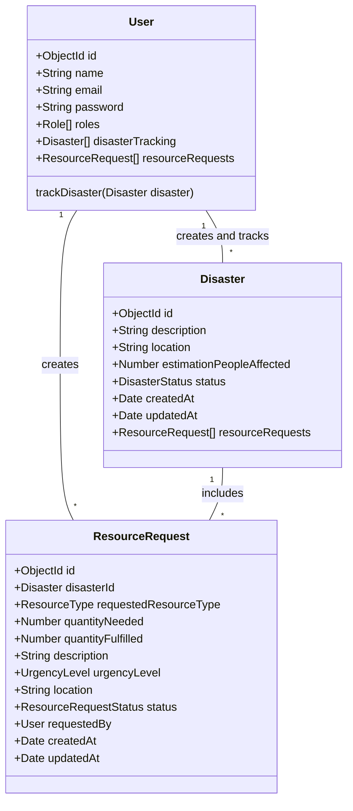
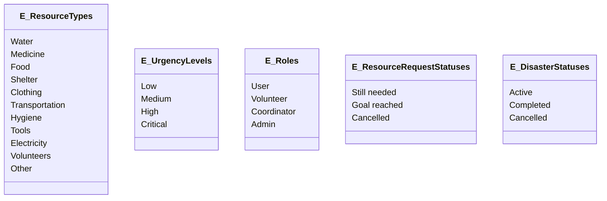

# Class Diagrams

---

```mermaid
classDiagram
    class User {
        +ObjectId id
        +String name
        +String email
        +String password
        +Role[] roles
        +Disaster[] disasterTracking
        +ResourceRequest[] resourceRequests
        trackDisaster(Disaster disaster)
    }

    class ResourceRequest {
        +ObjectId id
        +Disaster disasterId
        +ResourceType requestedResourceType
        +Number quantityNeeded
        +Number quantityFulfilled
        +String description
        +UrgencyLevel urgencyLevel
        +String location
        +ResourceRequestStatus status
        +User requestedBy
        +Date createdAt
        +Date updatedAt
    }

    class Disaster {
        +ObjectId id
        +String description
        +String location
        +Number estimationPeopleAffected
        +DisasterStatus status
        +Date createdAt
        +Date updatedAt
        +ResourceRequest[] resourceRequests
    }

    User "1" -- "*" ResourceRequest : creates
    User "1" -- "*" Disaster : creates and tracks
    Disaster "1" -- "*" ResourceRequest : includes
```

> There will be some enums for some of these types in order to ensure consistency across the platform. These are:

```mermaid
classDiagram
    class E_ResourceTypes {
        Water
        Medicine
        Food
        Shelter
        Clothing
        Transportation
        Hygiene
        Tools
        Electricity
        Volunteers
        Other
    }

    class E_UrgencyLevels {
        Low
        Medium
        High
        Critical
    }

    class E_Roles  {
        User
        Volunteer
        Coordinator
        Admin
    }

    class E_ResourceRequestStatuses {
        Still needed
        Goal reached
        Cancelled
    }

    class E_DisasterStatuses {
        Active
        Completed
        Cancelled
    }
```