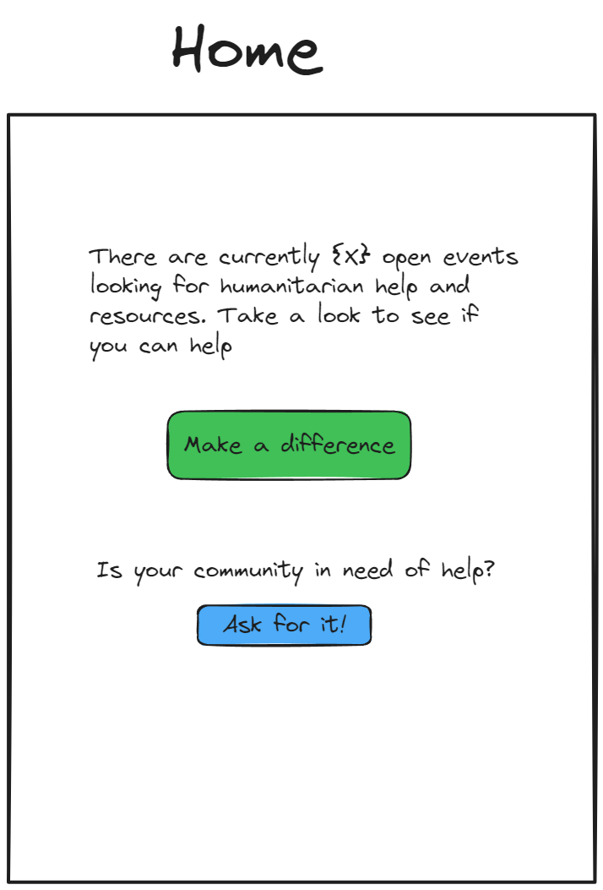
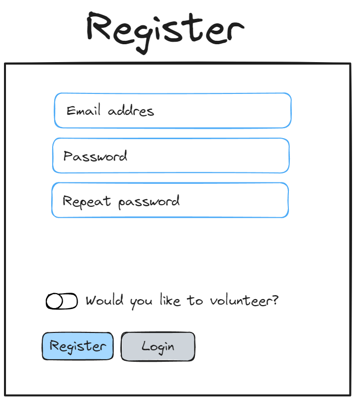
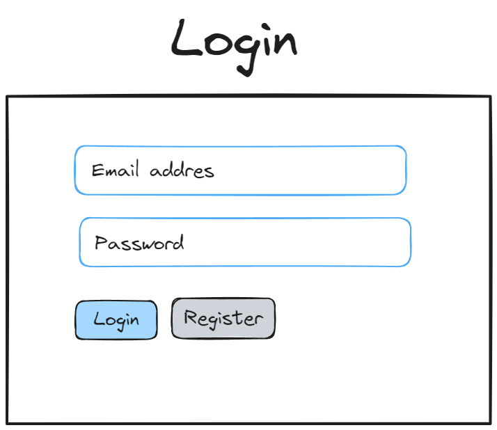
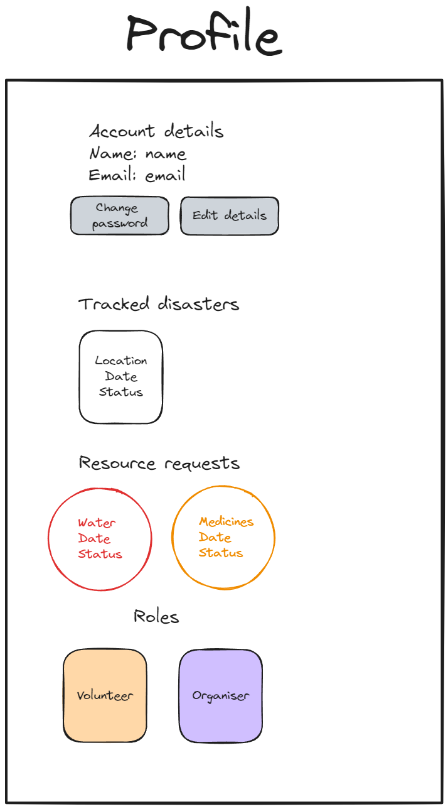
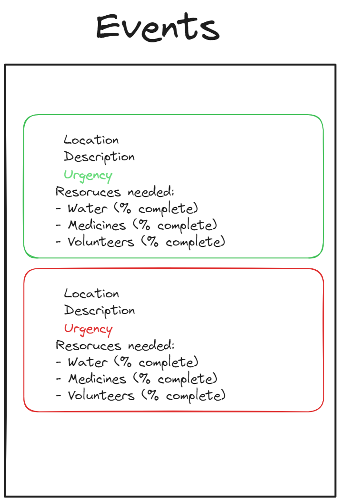
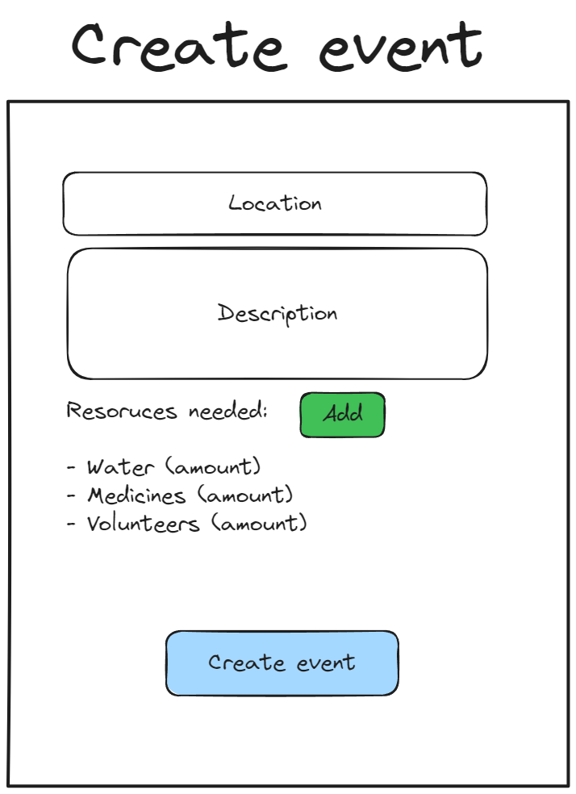
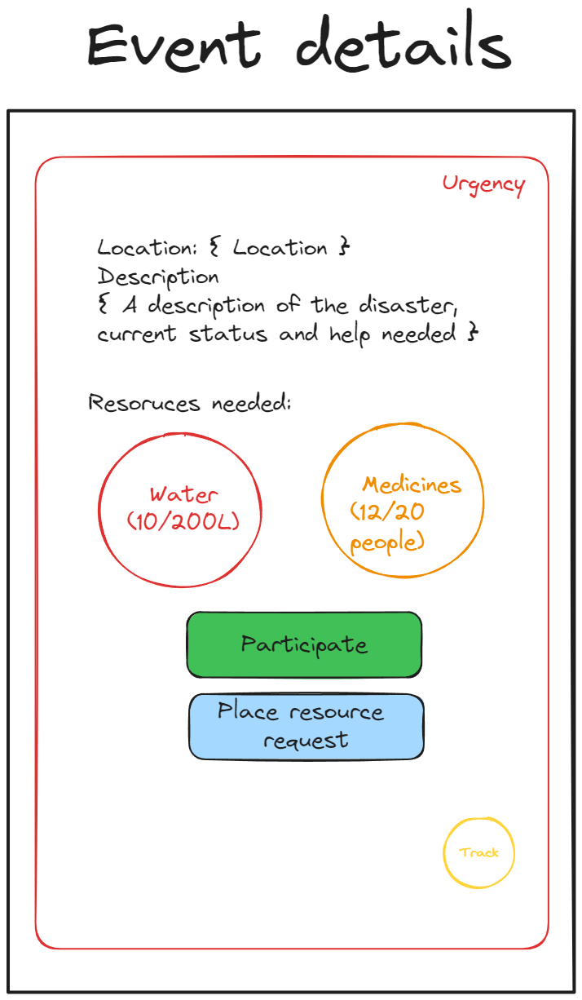
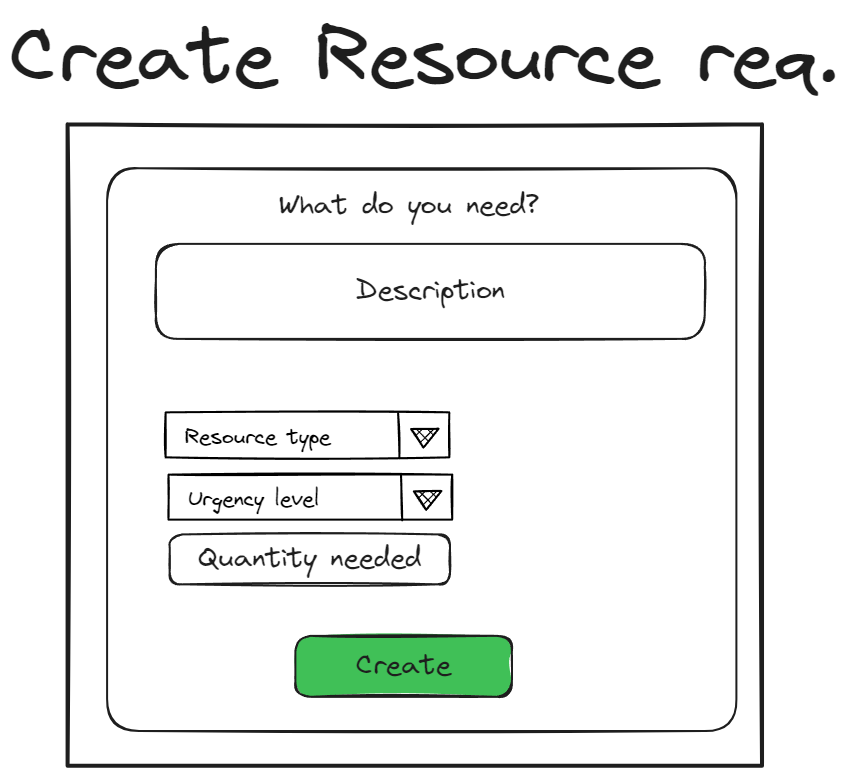
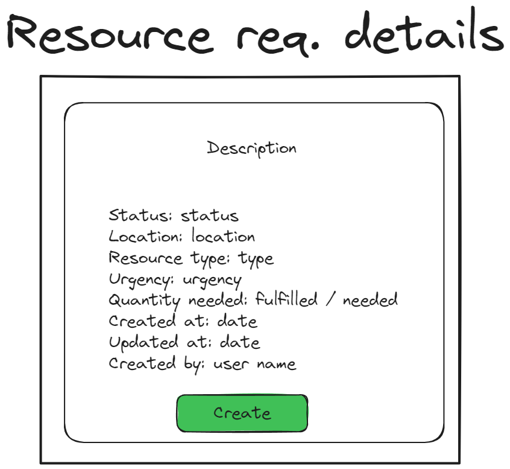

# Wireframes

---

> The wireframes below refer to the main components that will populate each of the pages. Other layout components such as headers, footers, and navigation bars are not included in the wireframes.
> Also please note that "Event" and "Disaster" are used interchangeably in the wireframes and the project proposal.

## Home Page

## User Registration

## User Login

## User Profile

## List of events

## Event Creation

## Event Details

## Resource Request creation

## Resource Request Details

